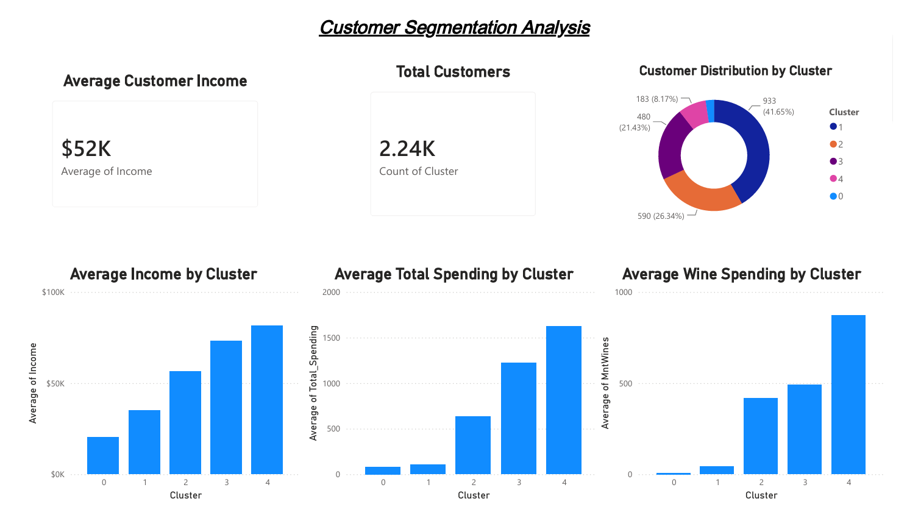

# Customer Segmentation Analysis using PCA & K-Means Clustering

## Project Overview

This project focuses on customer segmentation using unsupervised machine learning techniques. The objective is to identify distinct customer groups based on purchasing behavior, demographic characteristics, and campaign interactions.

Principal Component Analysis (PCA) was used for dimensionality reduction, followed by K-Means Clustering for customer segmentation. The results were visualized using Power BI to generate actionable business insights.

---

## Dashboard Preview



---

## Objectives

- Perform customer segmentation using clustering techniques.
- Reduce dimensionality using PCA while preserving data variance.
- Determine the optimal number of clusters using the Elbow Method and Silhouette Analysis.
- Identify meaningful customer personas.
- Create a Power BI dashboard to visualize customer segments and spending patterns.

---

## Dataset

**Dataset:** Marketing Campaign Dataset

The dataset contains customer demographic information, purchasing behavior, spending patterns, and campaign responses.

### Key Features

- Income
- Age
- Marital Status
- Education
- Product Spending Categories
- Store Purchases
- Web Purchases
- Catalog Purchases
- Campaign Responses

---

## Methodology

### 1. Data Preprocessing

- Handled missing values in the Income column.
- Removed unnecessary columns.
- Created Age from Year_Birth.
- Applied One-Hot Encoding to categorical variables.

### 2. Feature Scaling

- Standardized numerical features using StandardScaler.

### 3. Principal Component Analysis (PCA)

- Applied PCA for dimensionality reduction.
- Preserved 95% cumulative variance.
- Reduced dimensionality from 35 features to 27 principal components.

### 4. K-Means Clustering

- Determined optimal clusters using:
  - Elbow Method
  - Silhouette Analysis
- Segmented customers into 5 clusters.

### 5. Customer Profiling

Analyzed customer groups based on:

- Income
- Spending behavior
- Purchase channels
- Product preferences

### 6. Dashboard Development

Built an interactive Power BI dashboard to visualize:

- Customer Distribution by Cluster
- Average Income by Cluster
- Average Total Spending by Cluster
- Average Wine Spending by Cluster

---

## Key Results

### Cluster 0 – Low-Value Customers

- Lowest income segment.
- Minimal spending across all categories.
- Requires engagement and retention strategies.

### Cluster 1 – Budget-Conscious Customers

- Moderate income.
- Limited spending behavior.
- Responsive to discounts and promotions.

### Cluster 2 – Value-Oriented Customers

- Medium-to-high income.
- Consistent purchasing behavior.
- Strong potential for upselling.

### Cluster 3 – Premium Loyal Customers

- High income and spending.
- Frequent purchases across channels.
- Ideal candidates for loyalty programs.

### Cluster 4 – Elite High-Value Customers

- Highest income segment.
- Highest overall spending.
- Strong preference for premium products.
- Most valuable customer group.

---

## Technologies Used

- Python
- Pandas
- NumPy
- Matplotlib
- Seaborn
- Scikit-learn
- Jupyter Notebook
- Power BI

---

## Project Structure

```text
DecodelLab_Project3/
│
├── dashboard/
│   ├── Customer_Segmentation_Dashboard.pbix
│   └── Customer_Segmentation_Dashboard.png
│
├── data/
│   └── marketing_campaign.csv
│
├── notebooks/
│   └── Customer_Segmentation.ipynb
│
├── outputs/
│   ├── cluster_profiles.csv
│   └── customer_segments.csv
│
├── README.md
├── requirements.txt
└── .gitignore
```

---

## Business Insights

- Customer income strongly influences spending behavior.
- High-income customers contribute significantly more revenue.
- Cluster 4 represents the most profitable customer segment.
- Clusters 0 and 1 require targeted marketing campaigns to increase engagement.
- Segmentation enables personalized marketing and customer retention strategies.

---

## Outputs

### Generated Files

- `customer_segments.csv`
- `cluster_profiles.csv`
- `Customer_Segmentation_Dashboard.pbix`
- Dashboard Screenshot

---

## Author

**Aryaman Dutta**

Data Science & Analytics Project
